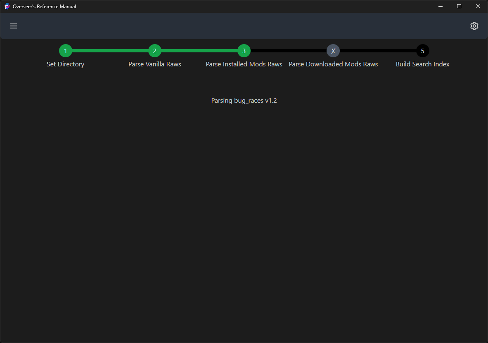

# Overseer's Reference Manual for Dwarf Fortress

This is a app which provides a searchable interface for your Dwarf Fortress raw files. It's built using
[Tauri](https://tauri.studio), [SolidJS](https://www.solidjs.com/), [TailwindCSS](https://tailwindcss.com/),
[daisyUI](https://daisyui.com/), and some [Rust](https://www.rust-lang.org/) code which parses the raws themselves
(using [dfraw_json_parser](https://github.com/nwesterhausen/dfraw_json_parser)).

Currently it will display (and let you search through):

- Most creature information
- Some plant information
- Basic inorganic material information

## Usage

When the app is started for the first time, it presents some instructions:

After a game directory is set and deemed valid by the app, it will parse and present data from the raws for searching
through.

## Supported Data

Includes some data about creatures, inorganic materials and plants.
