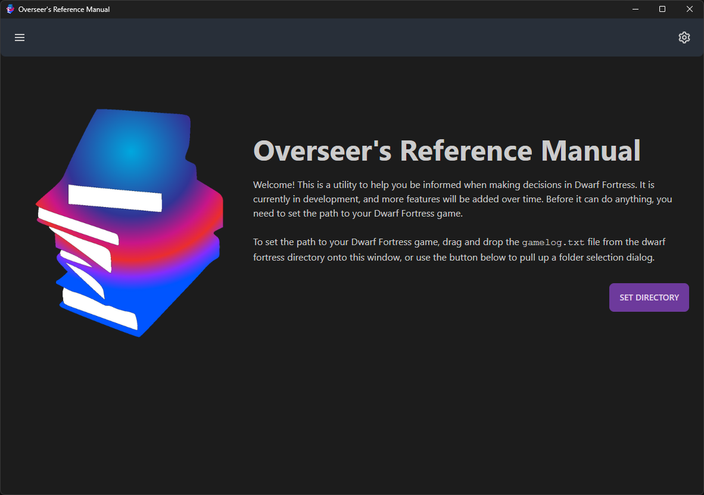

# Overseer's Reference Manual for Dwarf Fortress

This is a app which provides a searchable interface for the your Dwarf Fortress raw files. It's built using
[Tauri](https://tauri.studio), [SolidJS](https://www.solidjs.com/),
[Solid-Boostrap](https://solid-libs.github.io/solid-bootstrap), and some [Rust](https://www.rust-lang.org/) code which
parses the raws themselves.

## Usage

The app saves some data in `...AppData\Roaming\games.nwest.dwarffortress.overseer-manual` (or the equivalent on Linux or
MacOS) in a file `settings.json`:

| Key            | Description                                                 |
| -------------- | ----------------------------------------------------------- |
| `lastSaveUsed` | The most recently used save file                            |
| `dfSavesPath`  | Path to your Dwarf Fortress save directory (from last time) |

When the app is started for the first time, it presents some instructions:

After a save directory is set and deemed valid by the app (i.e. it will be truncated until it has "save" at the end of
the path), it will present this window:

Then you can simply select a save file listed in the "Change Save" dropdown and it will parse and present data from the
raws for searching through.

## Reference

### Creature Raws

Currently the following information is parsed out of the raws for creatures:

| Key               | Type                          | Description                                           |
| ----------------- | ----------------------------- | ----------------------------------------------------- |
| `identifier`      | `string`                      | The raw identity of the creature                      |
| `parent_raw`      | `string`                      | The name of the raw file this creature is in          |
| `objectId`        | `string`                      | A unique identifier for this creature                 |
| `names`           | `string[]`                    | All of the creature's names (amongst all castes)      |
| `description`     | `string`                      | The creature's description                            |
| `max_age`         | `{[key: string]: number[]}`   | Age distrubution by caste                             |
| `clutch_size`     | `{[key: string]: number[]}`   | Clutch size distrubution by caste                     |
| `lays_eggs`       | `boolean`                     | True if the creature lays eggs                        |
| `based_on`        | `string`                      | The `identifier` of the raw this creature is based_on |
| `biomes`          | `string[]`                    | List of biomes creature appears in naturally          |
| `cluster_range`   | `number[]`                    | Range (min, max) for wild appearances of the creature |
| `body_size`       | `CasteRange<BodySizeRange[]>` | Values by Caste to describe creature                  |
| `grown_at`        | `CasteRange<number>`          | Values by Caste to describe creature                  |
| `names_map`       | `CasteRange<string[]>`        | Values by Caste to describe creature                  |
| `egg_sizes`       | `CasteRange<number>`          | Values by Caste to describe creature                  |
| `pet_value`       | `CasteRange<number>`          | Values by Caste to describe creature                  |
| `intelligent`     | `CasteRange<boolean>`         | Values by Caste to describe creature                  |
| `flier`           | `CasteRange<boolean>`         | Values by Caste to describe creature                  |
| `gnawer`          | `CasteRange<boolean>`         | Values by Caste to describe creature                  |
| `trainable`       | `CasteRange<number>`          | Values by Caste to describe creature                  |
| `active_time`     | `CasteRange<number>`          | Values by Caste to describe creature                  |
| `inactive_season` | `CasteRange<number>`          | Values by Caste to describe creature                  |
| `creature_class`  | `CasteRange<string[]>`        | Values by Caste to describe creature                  |

### CasteRange<T> Type

This is just a convenience type for referencing data which is stored at the Caste level instead of Creature level
(actually most raw data is Caste-level).

| Key                                  | Type | Description                    |
| ------------------------------------ | ---- | ------------------------------ |
| `key in typeof CasteOptions[number]` | `T`  | Value stored for specified key |

#### CasteOptions

| Option            | Description                           |
| ----------------- | ------------------------------------- |
| `'SPECIES'`       | the creature generally                |
| `'child_SPECIES'` | children of the creature generally    |
| `'baby_SPECIES'`  | babies the creature generally         |
| `'ALL'`           | ALL Caste of the creature             |
| `'child_ALL'`     | children of ALL Caste of the creature |
| `'baby_ALL'`      | babies of ALL Caste of the creature   |
| `'MALE'`          | Male Caste of the creature            |
| `'child_MALE'`    | Male children Caste of the creature   |
| `'baby_MALE'`     | Male babies Caste of the creature     |
| `'FEMALE'`        | Female Caste of the creature          |
| `'child_FEMALE'`  | Female children Caste of the creature |
| `'baby_FEMALE'`   | Female babies Caste of the creature   |

### BodySizeRange Type

| Key        | Type     | Description                                              |
| ---------- | -------- | -------------------------------------------------------- |
| `years`    | `number` | How many years are needed to reach this size             |
| `days`     | `number` | How many days are needed to reach this size              |
| `size_cm3` | `number` | Size (in volume) obtained after `years` + `days` in time |

The creature raws are exported from the rust parser in [conversion.rs](/src-tauri/src/parser/conversion.rs). The client
side type definition is [Creature](/src/definitions/Creature.ts).
