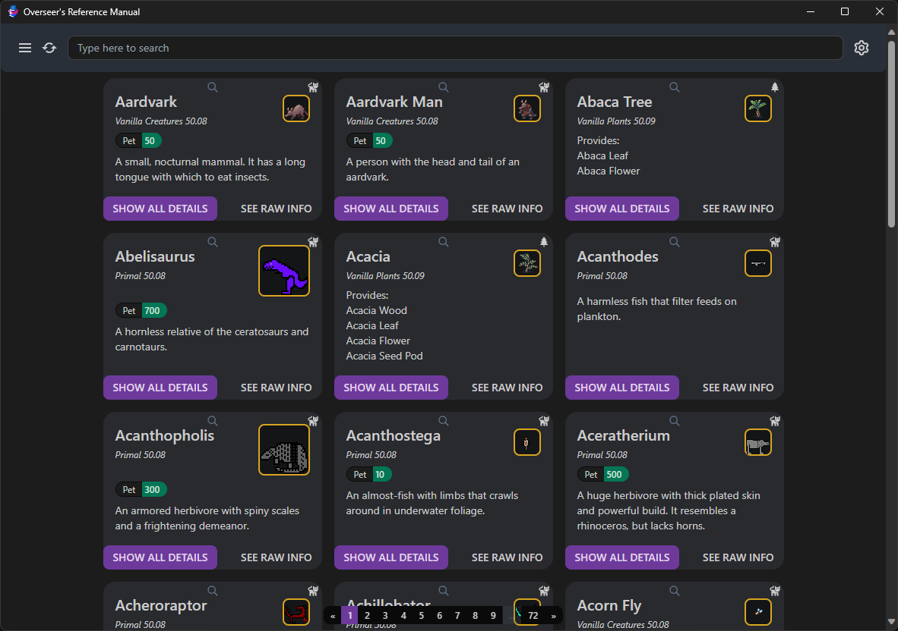

# Overseer's Reference Manual for Dwarf Fortress

This is a app which provides a searchable interface for the your Dwarf Fortress raw files. It's built using
[Tauri](https://tauri.studio), [SolidJS](https://www.solidjs.com/),
[Solid-Boostrap](https://solid-libs.github.io/solid-bootstrap), and some [Rust](https://www.rust-lang.org/) code which
parses the raws themselves (using [dfraw_json_parser](https://github.com/nwesterhausen/dfraw_json_parser)).

## Usage

The app saves some data in `...AppData\Roaming\games.nwest.dwarffortress.overseer-manual` (or the equivalent on Linux or
MacOS) in a file `settings.json`:

| Key            | Description                                                 |
| -------------- | ----------------------------------------------------------- |
| `lastSaveUsed` | The most recently used save file                            |
| `dfSavesPath`  | Path to your Dwarf Fortress save directory (from last time) |

When the app is started for the first time, it presents some instructions:

After a game directory is set and deemed valid by the app, it will parse and present data from the raws for searching
through.

## Supported Data

### Bestiary

The bestiary search includes all creatures defined in raws. It cannot include generated creatures because they are not
exposed in a readable format (since 50.xx release, raws are not stored with saves, and save data is in a special
format).
