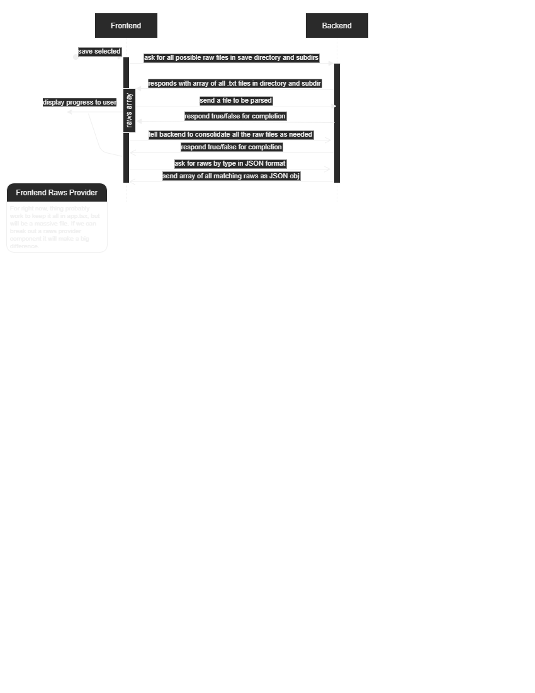

# App Flow

# Parsing Raws Timeslice

Below is a plan for how to make the application parse raws efficiently.

Currently, it works a little bit differently:

1. When reading the directories, the files and directories are filtered on the frontend in the response from the Tauri
   API for reading directories (instead of writing a function in the backend which does this for us).
2. When parsing raws, JSON is returned for each raw file sent instead of a boolean indicator of success. This mainly
   comes down to the large refactor that has to happen on the backend (essentially some persistent storage of some
   nature) before it can keep track of all the raws and handle marging them using "based_on" keys.
3. Finally, that brings us to the merging and sorting which is all done in the frontend since the backend has the
   problems mentioned in (2) for why it can't do it currently.
